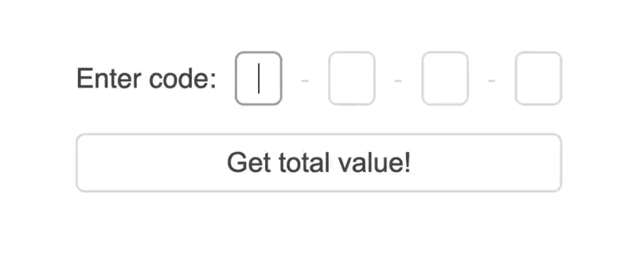

# React OTP input component

A simple, customizable and controlled component built with React.

## API
<table>
  <tr>
    <th>Name </th>
    <th>Type</th>
    <th>Required</th>
    <th>Description</th>
  </tr>
  <tr>
    <td>inputCount</td>
    <td>number</td>
    <td>true</td>
    <td>Number of OTP inputs to be rendered</td>
  </tr>
  <tr>
    <td>inputLength</td>
    <td>number</td>
    <td>true</td>
    <td>Length of each OTP input</td>
  </tr>
  <tr>
    <td>getValue</td>
    <td>function</td>
    <td>true</td>
    <td>Returns OTP total value typed in inputs</td>
  </tr>
    <tr>
     <td>label</td>
     <td>string</td>
     <td>false</td>
     <td>A simple label for OTP input</td>
   </tr>
  <tr>
    <td>separator</td>
    <td>string </td>
    <td>false</td>
    <td>This string will be placed between the inputs</td>
  </tr>
  <tr>
    <td>isNumeric</td>
    <td>boolean</td>
    <td>false</td>
    <td>Enabling this, prevents typing non-numeric values</td>
  </tr>
</table>

## Available Scripts

In the project directory, you can run:

### `npm start`

Runs the app in the development mode.
### `npm test`

Launches the test runner in the interactive watch mode.
